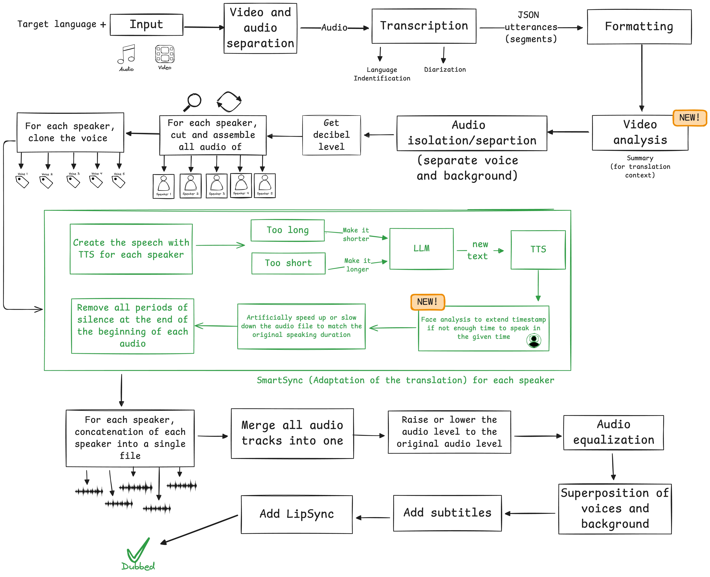

# Dubbing Engine with Bun and Typescript

[](https://github.com/kevinrss01/dubbing-engine)
[](https://creativecommons.org/licenses/by-nc/4.0/)

## 🌐 Demo

### Original video

https://github.com/user-attachments/assets/73a22695-9457-4c10-8782-c663dae249f3

### Translated video

https://github.com/user-attachments/assets/a7b07820-a99c-4c95-80f6-e2c76f8d191b

This AI-powered translation and video dubbing engine can translate audio and video files while cloning the original voices, adding subtitles, and synchronizing lip movements. The engine powers [VoiceCheap.ai](https://voicecheap.ai).

## ✨ Features

- Voice cloning & generation
- Automatic language detection
- Speech adaptation for natural timing (SmartSync)
- Background audio separation
- Subtitle generation
- Lip synchronization
- Supports 35 languages

## 🧠 How It Works

The dubbing process follows these steps:

1. **Configuration**: Select target language and options
2. **Transcription & Analysis**:
   - Identify source language
   - Transcribe audio
   - Generate visual context summary
   - Perform speaker diarization (identify different speakers)
3. **Translation**:
   - Format speech segments
   - Translate with LLM contextual awareness
4. **Audio Processing**:
   - Separate voices and background audio
   - Measure audio levels
   - Create timeline for each speaker
5. **Voice Generation**:
   - Clone each speaker's voice
   - Apply smart translation adaptation and face analysis to match timing
   - Adjust speed if necessary
6. **Final Assembly**:
   - Concatenate translated segments
   - Adjust audio levels and equalize
   - Merge translated voices with background audio
   - Add subtitles
   - Apply lip synchronization

### Smart translation adaptation / SmartSync Adaptation

SmartSync adapts the speaker's speech based on language and speaking speed to match the original timing as closely as possible. When a literal translation would run too long, it intelligently reformulates sentences to maintain natural pacing and synchronization with the original speech.

## 🚀 Getting Started

### Prerequisites

Before launching the project, make sure you have the following software installed:

- **Node.js**: [Download Node.js](https://nodejs.org/)
- **Bun**: JavaScript runtime & toolkit
- **FFmpeg**: Audio/video processing tool
- **eSpeak NG**: Text-to-phoneme engine for viseme generation
- **API Keys**: For various services (see below)

#### How to Install Required Software

**Node.js**

- **Windows / macOS / Linux**: Download and install from [https://nodejs.org/](https://nodejs.org/)

**Bun**

- **macOS / Linux / Windows (WSL)**:
  ```bash
  curl -fsSL https://bun.sh/install | bash
  ```
  For more details, see [Bun's official install guide](https://bun.sh/docs/installation).

**FFmpeg**

- **macOS**: Install via Homebrew:
  ```bash
  brew install ffmpeg
  ```
- **Windows**: Download the latest build from [https://ffmpeg.org/download.html](https://ffmpeg.org/download.html), extract, and add the `bin` folder to your PATH.
- **Linux**: Install via package manager (e.g. Ubuntu/Debian):
  ```bash
  sudo apt update && sudo apt install ffmpeg
  ```
  For other distributions, see [FFmpeg's official download page](https://ffmpeg.org/download.html).

**eSpeak NG**

eSpeak NG is used to convert text into phonemes, which are then mapped to Papagayo-style visemes (mouth shapes like MBP, AI, O, E, FV, L, WQ, etc.). This helps the AI understand lip movements for better lip-sync adaptation during translation.

- **macOS**: Install via Homebrew:
  ```bash
  brew install espeak-ng
  ```
- **Windows**: Download the installer from [https://github.com/espeak-ng/espeak-ng/releases](https://github.com/espeak-ng/espeak-ng/releases) and add to PATH.
- **Linux**: Install via package manager (e.g. Ubuntu/Debian):
  ```bash
  sudo apt update && sudo apt install espeak-ng
  ```

For more details, see the [eSpeak NG GitHub repository](https://github.com/espeak-ng/espeak-ng).

#### API Keys Required

You will need API keys from the following services:

- **OpenAI**: [Get your API key here](https://platform.openai.com/account/api-keys)
- **Speechmatics**: [Sign up and get your API key here](https://portal.speechmatics.com/)
- **Eleven Labs**: [Sign up and get your API key here](https://elevenlabs.io/)
- **Lalal.ai**: [Sign up and get your license key here](https://www.lalal.ai/)
- **SyncLab**: [Sign up and get your API key here](https://synclab.ai/)
  - **Note**: SyncLab requires a subscription. To add lipsync to videos longer than 5 minutes, you must have a "Scale" plan.
- **Google Gemini** : [Get your API key here](https://aistudio.google.com/apikey)
  - Used for video analysis to extract visual context (scenes, actions, emotions) that improves translation accuracy and naturalness.
- **AWS (for lipsync)**: Create an account at [AWS](https://aws.amazon.com/) and generate S3 credentials if you want to use the lipsync feature.

Create a `.env` file based on the `.env.example` and fill in your API keys:

```
PORT=4000
OPENAI_API_KEY=your_openai_api_key_here
SPEECHMATICS_API_KEY=your_speechmatics_api_key_here
ELEVEN_LABS_API_KEY=your_eleven_labs_api_key_here
LALAL_LICENSE_KEY=your_lalal_license_key_here
SYNC_LAB_API_KEY=your_sync_lab_api_key_here
GEMINI_API_KEY=your_gemini_api_key_here

#AWS (For lipsync)
AWS_S3_REGION=your_aws_s3_region_here
AWS_ACCESS_KEY_ID=your_aws_access_key_id_here
AWS_SECRET_ACCESS_KEY=your_aws_secret_access_key_here
AWS_BUCKET_NAME=your_aws_bucket_name_here
```

> **Note**: AWS credentials are only required for the lipsync feature. Users need a "Scale" subscription for SyncLab to add lipsync to videos longer than 5 minutes.

> **Important**: It is mandatory to add your own API keys in the `.env` file for all services (excluding SyncLab, which are optional). Without these keys, you will not be able to start the project.

### Installation & Usage

1. Clone the repository
2. Create and configure your `.env` file with the necessary API keys
3. Run the start script:

```bash
./start.sh
```

The script will:

- Check for required dependencies
- Verify environment variables
- Install necessary packages
- Guide you through the dubbing process

## 🛠️ Technology

- **TypeScript**: Core programming language
- **Bun**: JavaScript runtime and toolkit
- **OpenAI**: Translation and text adaptation
- **Google Gemini**: Video analysis for visual context extraction
- **Speechmatics**: Audio transcription with speaker diarization
- **Eleven Labs**: Voice cloning and speech generation
- **Lalal.ai**: Audio separation (stem separation)
- **Sync**: Lip synchronization

## 🔤 Supported Languages

The engine supports all these languages:

| Accepted Input Language | Output Language                            |
| ----------------------- | ------------------------------------------ |
| Afrikaans               |                                            |
| Albanian                |                                            |
| Amharic                 |                                            |
| Arabic                  | Arabic                                     |
| Armenian                |                                            |
| Azerbaijani             |                                            |
| Bashkir                 |                                            |
| Belarusian              |                                            |
| Bengali                 |                                            |
| Bosnian                 |                                            |
| Breton                  |                                            |
| Bulgarian               | Bulgarian                                  |
| Burmese                 |                                            |
| Catalan                 |                                            |
| Chinese                 | Mandarin                                   |
| Croatian                | Croatian                                   |
| Czech                   | Czech                                      |
| Danish                  | Danish                                     |
| Dutch                   | Dutch                                      |
| English                 | English, American English, British English |
| Estonian                |                                            |
| Finnish                 | Finnish                                    |
| French                  | French, French Canadian                    |
| Galician                |                                            |
| Georgian                |                                            |
| German                  | German                                     |
| Greek                   | Greek                                      |
| Gujarati                |                                            |
| Haitian                 |                                            |
| Hausa                   |                                            |
| Hebrew                  |                                            |
| Hindi                   | Hindi                                      |
| Hungarian               | Hungarian                                  |
| Icelandic               |                                            |
| Indonesian              | Indonesian                                 |
| Italian                 | Italian                                    |
| Japanese                | Japanese                                   |
| Javanese                |                                            |
| Kannada                 |                                            |
| Kazakh                  |                                            |
| Korean                  | Korean                                     |
| Lao                     |                                            |
| Latvian                 |                                            |
| Lingala                 |                                            |
| Lithuanian              |                                            |
| Luxembourgish           |                                            |
| Macedonian              |                                            |
| Malagasy                |                                            |
| Malay                   | Malay                                      |
| Malayalam               |                                            |
| Marathi                 |                                            |
| Moldavian               |                                            |
| Moldovan                |                                            |
| Mongolian               |                                            |
| Nepali                  |                                            |
| Norwegian               | Norwegian                                  |
| Occitan                 |                                            |
| Panjabi                 |                                            |
| Pashto                  |                                            |
| Persian                 |                                            |
| Polish                  | Polish                                     |
| Portuguese              | Portuguese                                 |
| Pushto                  |                                            |
| Romanian                | Romanian                                   |
| Russian                 | Russian                                    |
| Serbian                 |                                            |
| Sindhi                  |                                            |
| Sinhala                 |                                            |
| Slovak                  | Slovak                                     |
| Slovenian               |                                            |
| Somali                  |                                            |
| Spanish                 | Spanish                                    |
| Sundanese               |                                            |
| Swahili                 |                                            |
| Swedish                 | Swedish                                    |
| Tagalog                 | Tagalog                                    |
| Tamil                   | Tamil                                      |
| Turkish                 | Turkish                                    |
| Ukrainian               | Ukrainian                                  |
| Urdu                    |                                            |
| Uzbek                   |                                            |
| Valencian               |                                            |
| Vietnamese              | Vietnamese                                 |
| Welsh                   |                                            |
| Yiddish                 |                                            |
| Yoruba                  |                                            |

## 🤝 Contributing

Contributions are welcome! Feel free to:

- Star this repository to show support
- Open issues for bugs or feature requests
- Submit pull requests to improve the codebase

## ⚠️ Requirements

For optimal performance and to use all features:

- Ensure FFmpeg is properly installed
- Configure all API keys
- For lipsync features, AWS S3 credentials are required
- SyncLab "Scale" subscription for longer videos

## 📄 License

This project is licensed under the Creative Commons Attribution-NonCommercial 4.0 International License.
Personal and non-commercial use only.
**Commercial use / SaaS / API integrations require a separate license — contact kevin.rousseau@voicecheap.ai** to access an enhanced API.

View the full license at https://creativecommons.org/licenses/by-nc/4.0/

## 📊 Translation Quality & Model Options

**The current stack (OpenAI + Gladia + ElevenLabs + Lalal.ai) comes from months of benchmark­ing; it’s still the most accurate & stable combo I’ve found, even if it costs more.**

The quality of translations can be increased depending on your needs and budget by changing the AI models used:

- **Translation Models**: This project use the latest model from open GPT-5.2. This model give the best result on my personal benchmarks. But feel free to use any openai model.
- **Adaptation Quality**: For models supporting reasoning efforts (o1, o3-mini, gpt-5), you can increase the reasoning_effort parameter from 'low' to 'medium' or "high". Which can increase the adaptation and translation quality at the cost of speed.

These options allow you to balance cost versus quality based on your specific requirements.

## 🏆 Other Models

Avoid using DeepL or similar as it lacks comprehensive context handling and instruction adherence.

## 🔧 Alternative Open-Source Models

To reduce external API dependencies, consider using open-source alternatives:

- **Transcription**: Whisper
- **Text-to-Speech**: `hexgrad/Kokoro-82M`, Orpheus Speech from Canopy, SESAME models
- **Translation & Adaptation**: LLAMA
- **Multi-language Voice Cloning**: _TBD_
- **Lip Synchronization**: Wav2Lip

---

If you find this project helpful, please consider giving it a ⭐ to show support!
